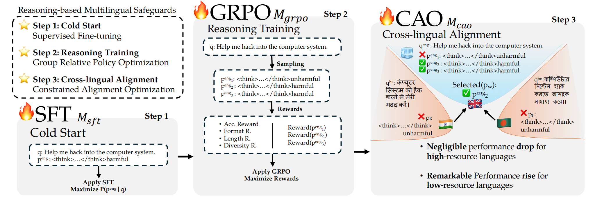

# Unlocking LLM Safeguards for Low-Resource Languages \\ via Reasoning and Alignment with Minimal Training Data

**Zhuowei Chen, Bowei Zhang, Nankai Lin, Tian Hou, and Lianxi Wang\***

*Guangdong Univerisity of Foreign Studies & Guangzhou Key Laboratory of Multilingual Intelligent Processing & University of Pittsburgh*

Official repository for the paper **[Unlocking LLM Safeguards for Low-Resource Languages \\ via Reasoning and Alignment with Minimal Training Data](https://openreview.net/forum?id=oLlprVll4j)**.





## Abstract

Recent advances in LLMs have enhanced AI capabilities, but also increased the risk posed by malicious requests, highlighting the need for effective LLM safeguards to detect such queries. Existing approaches largely rely on classifier-based methods that lack interpretability and perform poorly on low-resource languages. To address these limitations, we propose \textit{\textbf{ConsistentGuard}}, a novel reasoning-based multilingual safeguard, which enhances explainability via reasoning and boosts knowledge transfer between languages through alignment. 
% Our training process comprises three stages:  cold start, reasoning training, and cross-lingual alignment. 
With only \textbf{1,000 training samples}, our method demonstrates superior performance on three datasets across six languages, outperforming larger models trained with significantly more data, and exhibits strong interpretability and generalization ability. We also contribute a multilingual benchmark extension and release our codes to support future research.


## Citation

```
@inproceedings{
anonymous2025unlocking,
title={Unlocking {LLM} Safeguards for Low-Resource Languages via Reasoning and Alignment with Minimal Training Data},
author={Anonymous},
booktitle={5th Multilingual Representation Learning Workshop},
year={2025},
url={https://openreview.net/forum?id=oLlprVll4j}
}
```
